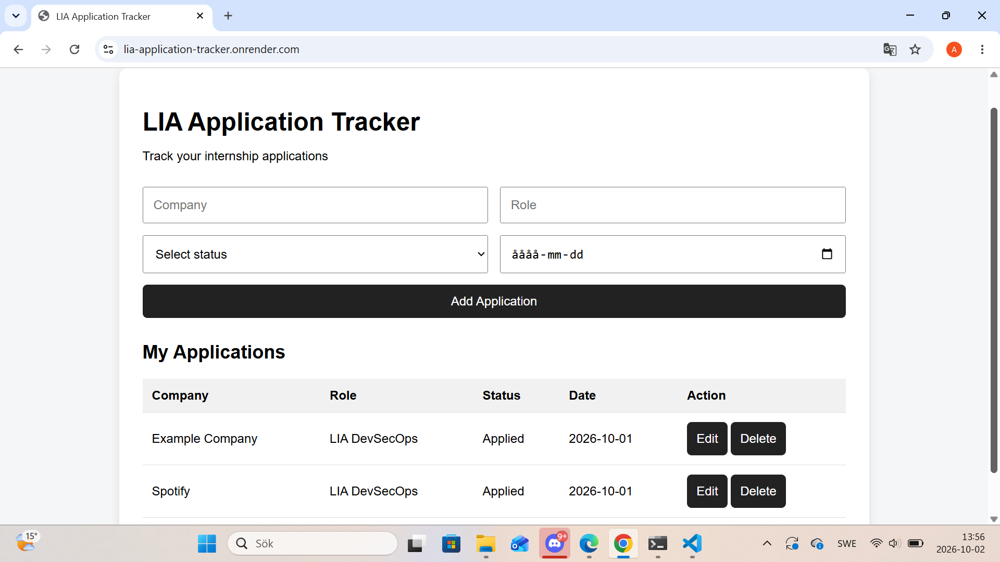

# LIA Application Tracker

## Live Demo

https://lia-application-tracker.onrender.com

## GitHub Repository

https://github.com/AfrovitiXhoga/lia-application-tracker

A simple full-stack web application for tracking internship (LIA) applications.

## Features

- Add new applications
- View all applications
- Edit applications
- Delete applications
- Persistent data storage
- REST API

## Technologies

- Node.js
- Express.js
- JavaScript
- HTML
- CSS
- JSON
- REST API

## API Endpoints

- GET /api/applications
- POST /api/applications
- PUT /api/applications/:id
- DELETE /api/applications/:id

## Purpose

This project was built as a personal project to practice full-stack development, REST APIs and basic backend/frontend integration.
## What I learned

While building this project I practiced:

- Creating a REST API with Node.js and Express
- Connecting a frontend to a backend API
- Working with CRUD operations
- Saving and loading data from JSON
- Using Git and GitHub for version control
- Deploying a Node.js application with Render
- Working with environment variables such as PORT
## Screenshot

## Run locally

Install dependencies:

npm install

Start the server:

node index.js

Then open:

http://localhost:3000
## Docker

Build the image:

docker build -t lia-application-tracker .

Run the container:

docker run -p 3000:3000 lia-application-tracker

Then open:

http://localhost:3000